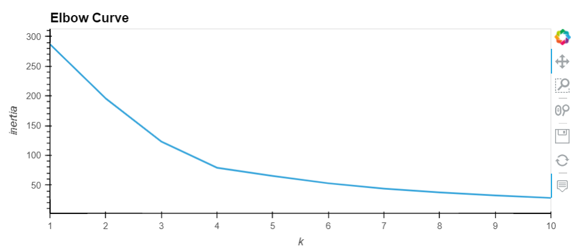
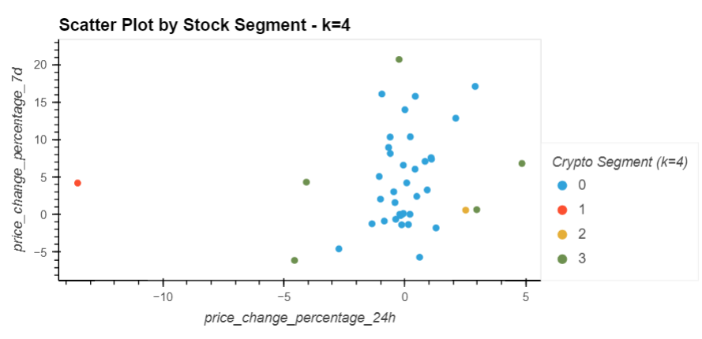
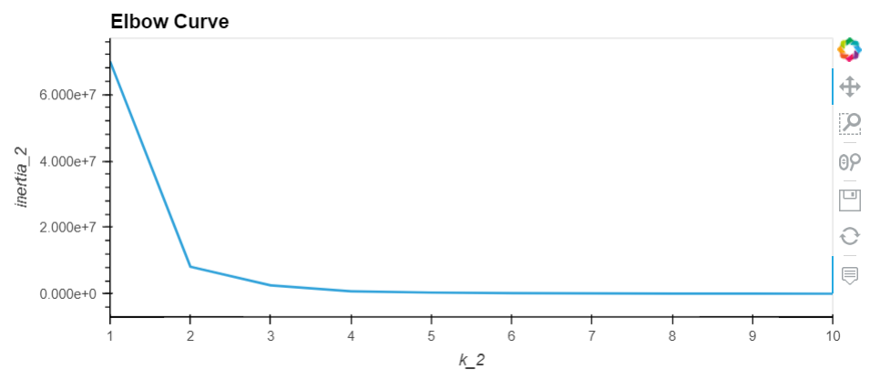
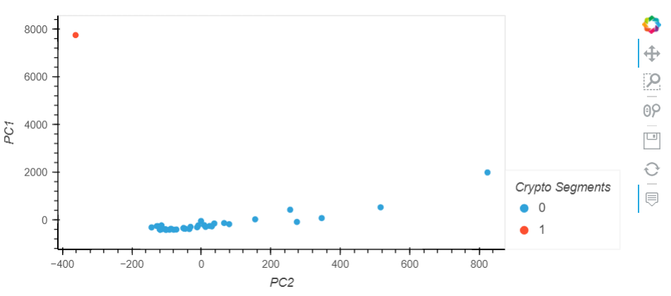

# Crypto Investments Clustering

This project entails building a code that clusters cryptocurrencies by their performance in different time periods. With this purpose, different unsupervised learning features are used:

1. Finding the Best Value for k visually with the elbow method. 
2. Clustering Cryptocurrencies with K-means and then optimizing with PCA.
3. Finding the Best Value for k Using the PCA Data.
4. Clustering Cryptocurrencies with K-means Using the PCA Data.
5. Visualizing and Comparing the Results.

---

## Technologies

The whole project is implemented in Python, writen in Jupyter lab using the Pandas library and hvplot for plotting: 

* ```import pandas as pd```
* ```from pathlib import Path```
* ```import hvplot.pandas```

We also import the necessary packages for the Machine Learning part using Scikit-learn:

* ```from sklearn.cluster import KMeans```
* ```from sklearn.decomposition import PCA```
* ```from sklearn.preprocessing import StandardScaler```

The main ```crypto_investments.ipynb``` file reads from the csv files contained in the 'Resources' folder.

---

## Usage

Run the main ```crypto_investments.ipynb``` in Jupyter Lab. 

**First**, the Data is converted into a pandas dataframe and then prepared before running the K-Means algorith by:

* Normalizing the CSV data with the StandardScaler module
* Creating a DataFrame that contains the scaled data


**Second**, we find the best value for k (range 1 to 11) using the elbow method for the original Data:



And then cluster it with the best k identified visually:




**Third**, we perform a principal component analysis (PCA) to reduce the features to three principal components, analyze the total variance explained by them and then find the best value for k with this PCA Data (again with the elbow method):



And then also cluster it with the best k identified visually:




**Finally**, we compare both results and conclude that, by using using fewer features to cluster the data using K-Means, we get reduced complexity and a simpler segmentation which makes it easier to gain insights into the data in this case.

---

## Contributors

Feature developed by Lourdes Dominguez [(LinkedIn profile)](https://www.linkedin.com/in/lourdes-dominguez-bengoa-12333044/)

---

## License

Use for academic purposes only.


